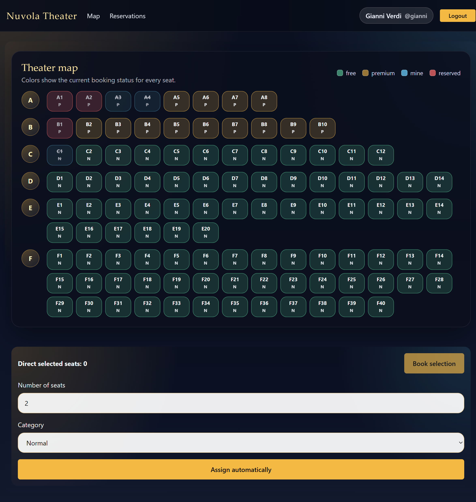

[](https://classroom.github.com/a/qm-fpFT_)
# Exam #1: "theater"
## Student: s362925 Martino Rocco 

## React Client Application Routes

- Route `/`: main theater page with the seat map, direct booking, and automatic booking form.
- Route `/login`: login page with username/password and optional TOTP second factor.
- Route `/reservations`: list of the logged user reservations. After TOTP authentication, admin users can see all reservations for every user.
- Route `*`: fallback page shown when the route does not exist.

## API Server

* **POST `/api/sessions`**: authenticate a user with mail and password.
  - **Request**: JSON object with `mail` and `password`.
    ```
    { "mail": "gianni@example.com", "password": "password" }
    ```
  - **Response body**: the logged user object, or an error object if authentication fails.
    ```
    { "id": 2, "username": "gianni", "name": "Gianni Verdi",
      "canDoTotp": true, "isTotp": false, "isAdmin": true }
    ```
  - **Codes**: `200 OK`, `401 Unauthorized`, `500 Internal Server Error`.

* **GET `/api/sessions/current`**: get the current logged-in user.
  - **Request**: no parameters. (credentials: 'include')
  - **Response body**: the current user object if the session is valid.
  - **Codes**: `200 OK`, `401 Unauthorized`.

* **DELETE `/api/sessions/current`**: logout the current user.
  - **Request**: no parameters. (credentials: 'include')
  - **Response body**: empty object.
  - **Codes**: `200 OK`.

* **POST `/api/login-totp`**: perform the second factor authentication through TOTP.
  - **Request**: JSON object with the verification code.
    ```
    { "code": "123456" }
    ```
  - **Response body**: fixed JSON object on success.
    ```
    { "otp": "authorized" }
    ```
  - **Codes**: `200 OK`, `401 Unauthorized`, `400 Bad Request`, `503 Service Unavailable`.
    - `401 Unauthorized`: user is not logged in, or the TOTP code is invalid.
    - `400 Bad Request`: the logged user does not have a TOTP secret.

* **GET `/api/theater`**: get the theater map.
  - **Request**: no parameters. (credentials: 'include')
  - **Response body**: theater object with rows, seats, categories, and reservation status.
    ```
    { "rows": [ { "label": "A", "seats": [
      { "id": 1, "label": "A1", "category": "premium", "reserved": true,
        "mine": false, "cooldown": false,
        "reservation": { "ownerId": 1, "ownerName": "Luca Neri" } }
    ] } ] }
    ```
  - **Codes**: `200 OK`, `500 Internal Server Error`.

* **GET `/api/my-seats`**: get the seats booked by the logged user.
  - **Request**: no parameters. (credentials: 'include')
  - **Response body**: flat list of seat objects for the current user.
    ```
    [ { "id": 3, "row_label": "A", "row_order": 1, "seat_number": 3,
        "category": "premium", "reservation_id": 3,
        "created_at": "2026-05-29T15:20:00.000Z" } ]
    ```
  - **Codes**: `200 OK`, `401 Unauthorized`, `500 Internal Server Error`.

* **GET `/api/admin/reservations`**: get all reservations with seat details.
  - **Request**: no parameters. (credentials: 'include')
  - **Response body**: flat list of reserved seats with reservation and owner information.
    ```
    [ { "id": 3, "row_label": "A", "row_order": 1, "seat_number": 3,
        "category": "premium", "reservation_id": 3, "owner_id": 2,
        "created_at": "2026-05-29T15:20:00.000Z",
        "owner_name": "Gianni Verdi", "owner_username": "gianni" } ]
    ```
  - **Codes**: `200 OK`, `401 Unauthorized`, `500 Internal Server Error`.
  - **Note**: this endpoint requires a valid TOTP session. In the seed data, only admin users have a TOTP secret enabled.

* **POST `/api/reservations/direct`**: create a reservation using selected seats.
  - **Request**: JSON object with `seatIds`.
    ```
    { "seatIds": [1, 2, 3] }
    ```
  - **Response body**: created reservation object.
    ```
    { "reservation_id": 5, "seat_ids": [1, 2, 3] }
    ```
  - **Codes**: `201 Created`, `401 Unauthorized`, `422 Unprocessable Entity`, `400 Bad Request`.
    - `422 Unprocessable Entity`: invalid request body.
    - `400 Bad Request`: one or more seats do not exist, are already reserved, or are still on cooldown for the user.

* **POST `/api/reservations/assign`**: automatically assign a reservation.
  - **Request**: JSON object with `count` and `category`.
    ```
    { "count": 2, "category": "normal" }
    ```
  - **Response body**: created reservation object.
    ```
    { "reservation_id": 5, "seat_ids": [19, 20] }
    ```
  - **Codes**: `201 Created`, `401 Unauthorized`, `422 Unprocessable Entity`, `400 Bad Request`.
    - `422 Unprocessable Entity`: invalid request body.
    - `400 Bad Request`: not enough seats are available, or selected seats are still on cooldown for the user.

* **POST `/api/reservations/modify`**: update an existing reservation.
  - **Request**: JSON object with `oldReservationId` and `seatIds`.
    ```
    { "oldReservationId": 1, "seatIds": [4, 5] }
    ```
  - **Response body**: newly created replacement reservation object. The server deletes the old reservation and creates a new one.
    ```
    { "reservation_id": 6, "seat_ids": [4, 5] }
    ```
  - **Codes**: `201 Created`, `401 Unauthorized`, `403 Forbidden`, `404 Not Found`, `422 Unprocessable Entity`, `400  Bad Request`.
    - `403 Forbidden`: the reservation belongs to another user and the requester is not authorized as an admin with TOTP.
    - `404 Not Found`: the reservation does not exist anymore.
    - `422 Unprocessable Entity`: invalid request body.
    - `400 Bad Request`: the replacement reservation cannot be created because one or more seats do not exist, are already reserved, or another application error occurred.

* **DELETE `/api/reservations/:id`**: delete a reservation.
  - **Request**: `id` path parameter.
  - **Response body**: confirmation object after releasing the related seats.
    ```
    { "message": "Reservation deleted" }
    ```
  - **Codes**: `200 OK`, `401 Unauthorized`, `403 Forbidden`, `404 Not Found`, `422 Unprocessable Entity`, `400 Bad Request`.
    - `403 Forbidden`: the reservation belongs to another user and the requester is not authorized as an admin with TOTP.
    - `404 Not Found`: the reservation does not exist anymore.
    - `422 Unprocessable Entity`: invalid `id` path parameter.
    - `400 Bad Request`: the reservation cannot be released because of an application or database error.

## Database Tables

- Table `users` - registered users.
  - Columns: `id` (primary key), `username`, `mail`, `name`, `hash`, `salt`, `isAdmin`, `secret`, `lastTotpStep`.
- Table `seats` - all theater seats and their static properties.
  - Columns: `id` (primary key), `row_label`, `row_order`, `seat_number`, `category`.
- Table `reservations` - reservation headers, one row per booking.
  - Columns: `id` (primary key), `owner_id`, `created_at`, `updated_at`.
- Table `reservation_seats` - association table between reservations and seats.
  - Columns: `reservation_id`, `seat_id`.
- Table `released_seats` - tracks seats released after a reservation is modified or deleted.
  - Columns: `id` (primary key), `user_id`, `seat_id`, `released_at`.

## Main React Components

- `AppContent` (in `App.jsx`): main application component. It keeps the authentication state, theater map state, direct/automatic reservation state, toast messages, and route definitions.
- `AppLayout` (in `AppLayout.jsx`): main page layout with navbar, login/logout area, and shared outlet.
- `SeatMap` (in `seats.jsx`): renders the theater grid and shows seat status with colors and labels.
- `ReservationsList` (in `ReservationsList.jsx`): shows the user's reservations or the admin view, and supports edit/delete actions.
- `LoginLayout` and `TotpLayout` (in `Layout.jsx`): wrapper pages that render the login and second-factor authentication forms from `Auth.jsx`.
- `LoginForm` and `TotpForm` (in `Auth.jsx`): forms used to authenticate with password and optional TOTP code.
- `Toast` (in `App.jsx`): component with the role of printing and giving feedback of the Messages/ErrMessages, to be delivered at the user.


## Screenshot



## Users Credentials


| Email | Password | Role |
| :--- | :--- | :--- |
| luca@example.com | password | User |
| maria@example.com | password | **ADMIN** |
| gianni@example.com | password | **ADMIN** |
| elena@example.com | password | User |